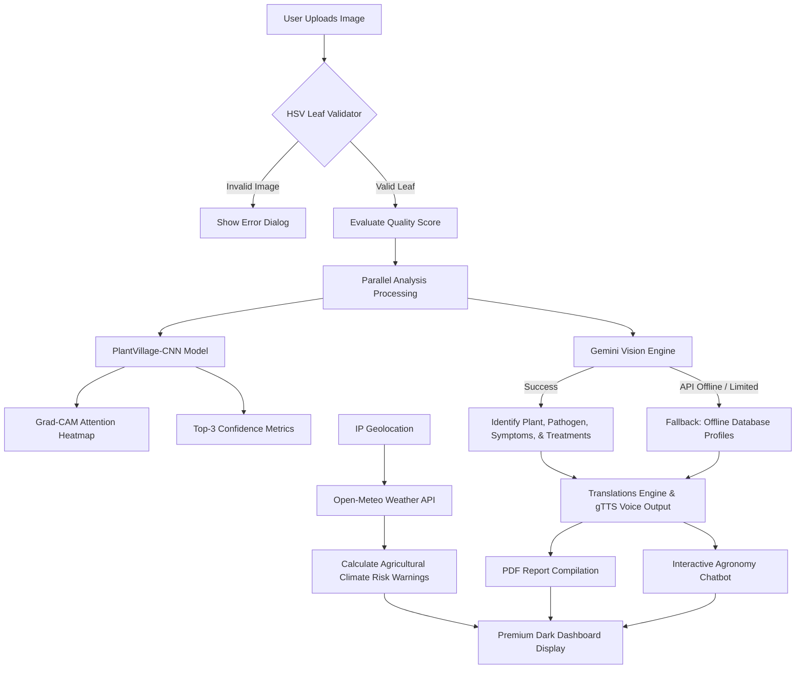

# 🌿 CropSense AI v3.0 Pro
### *Intelligent Crop Disease Detection & Farm Management Dashboard*

[](https://www.python.org/)
[](https://streamlit.io/)
[](https://www.tensorflow.org/)
[](https://deepmind.google/technologies/gemini/)
[](https://creativecommons.org/licenses/by-sa/3.0/)

---

## 📖 Project Overview
**CropSense AI v3.0 Pro** is a production-ready, interactive farm management and agricultural diagnosis platform. It implements a **dual-engine AI architecture** to identify leaf diseases with high precision. By combining a local convolutional neural network (CNN) trained on over 54,000 leaf images (PlantVillage dataset) with Google Gemini Vision’s large multimodal capabilities, the system classifies 38 distinct crop diseases, flags non-leaf submissions, and diagnoses generic plant species in real-time. 

Additionally, the system provides geolocated weather analysis, localized crop health risk calculations, custom PDF reporting, audio speech recommendation readouts, translation into 70+ languages, and interactive chat support.

---

## 🧱 Implemented Features

*   **⚡ Dual AI Diagnostics (CNN & Gemini Vision):** Run dual checks using a fast, offline-capable CNN model and fallback Google Gemini Vision API to confirm species and disease details.
*   **🗺️ Conv attention visualizations (Grad-CAM):** Plots visual heatmaps mapping the exact convolutional activation regions of the CNN model.
*   **📸 Dynamic Leaf validation:** Employs HSV color threshold checks and brightness constraints to instantly validate and reject non-leaf submissions.
*   **📊 Farming Analytics Dashboard:** Monitor diagnostic scans activity trends over time, plant categories monitored, and diagnosed severity distributions via custom Plotly graphs.
*   **📜 Searchable Scan Registry:** Manage, filter, search, sort, and permanently delete local predictions stored in your personal CSV database log.
*   **📄 Bespoke PDF Auditing Reports:** Instantly compile diagnostic findings, local coordinate logs, temperature indices, weather risks, organic treatment details, NPK formulas, and crop rotation advisories into download-ready PDF booklets.
*   **🌍 Multilingual Speech Readouts:** Translates all AI recommendations, symptoms, and organic treatment plans into 70+ languages with immediate audio readouts.
*   **🎙️ Browser STT Chatbot:** Talk directly to a farming assistant powered by Gemini chatbot memory, utilizing your client-side browser Web Speech API.
*   **🌡️ Local Geolocation & Climate Analytics:** Uses IP coordinates to fetch real-time climate data (temperature, wind speeds, rainfall, UV index) from the Open-Meteo API and alerts users to frost, heat stress, drought, or storm thresholds.
*   **🔑 Passwordless Access Control:** Secured user registration, login forms, CAPTCHA sum checks, and mobile OTP verifications.

---

## 🎨 Technologies Used
| Layer | Tech / Tool / Library | Purpose |
|---|---|---|
| **Core Framework** | Streamlit | Python-based interactive web frontend & layout |
| **Deep Learning** | TensorFlow / Keras | CNN Model loading, predictions, and weights |
| **Generative AI** | Google Gemini 2.5 Flash API | Zero-shot image diagnosis & chatbot memory |
| **Computer Vision** | OpenCV / PIL | Image preprocessing, quality scoring, and Grad-CAM math |
| **Data Analytics** | Pandas / Numpy | Diagnostic histories, CSV operations, database logs |
| **Plotting & Visuals** | Plotly Express / Matplotlib | Interactive dashboard charts & color mappings |
| **Document Generation** | ReportLab | PDF Report compiler & styling engine |
| **TTS & Speech** | gTTS | Google Text-to-Speech audio reader |
| **Translation Engine** | Deep Translator | Recommendations translator into 70+ global languages |
| **APIs Used** | Open-Meteo & Geolocation | Weather variables & coordinate tracking |

---

## 📐 Project Architecture & Workflow



### 🔄 Diagnosis & Chat Workflow
1.  **Authentication:** The user logs in securely using their registered mobile number, CAPTCHA validation, and a simulated 4-digit OTP.
2.  **Scan Phase:** The user uploads a leaf image (or captures one via webcam). The system checks if it is a valid leaf and measures its contrast and sharpness.
3.  **Analytics Phase:** The system extracts GPS coordinates to query the local weather environment. The CNN outputs raw class scores, and Gemini compiles advanced symptoms, chemical active ingredients, organic remedies, and NPK parameters.
4.  **Interaction Phase:** The agronomist dashboard updates. Users can download PDF reports, listen to vocal readouts, or query the chatbot about preventative farming practices.

---

## 📸 Screenshots Section

Below are visual design mockups representing the premium Dark Mode dashboard interfaces:

| Sign In & Access Control | Analysis Dashboard |
|:---:|:---:|
| `` | `` |

| Geolocation & Weather Risks | Chatbot & Voice Readout |
|:---:|:---:|
| `` | `` |

---

## 📂 Folder Structure

```
PlantVillage-Dataset/
├── .streamlit/
│   └── secrets.toml          # Streamlit API Secrets
├── history/
│   └── predictions_*.csv    # User-specific local diagnostic logs
├── model/
│   ├── best_plant_disease_model.keras  # Trained TensorFlow CNN weights
│   └── class_names.txt      # Class name indexes (38 PlantVillage classes)
├── utils/
│   ├── __init__.py
│   ├── offline_database.py  # Local fallback database dictionary (38 classes)
│   └── weather_locator.py   # Geolocation, Open-Meteo, & Climate Risk calculations
├── .env.example             # Template for API credentials
├── .gitignore               # Ignored system and local folders
├── app.py                   # Streamlit Frontend, logic flow, and CSS styles
├── requirements.txt         # Package dependencies file
└── README.md                # Project documentation
```

---

## ⚙️ Model Details & Dataset Information

### CNN Classifier
The local classification model is a deep Convolutional Neural Network (CNN) trained on the **PlantVillage dataset**.
*   **Classes Supported:** 38 distinct labels (covering Apple, Blueberry, Cherry, Corn, Grape, Peach, Pepper, Potato, Raspberry, Soybean, Strawberry, Squash, and Tomato).
*   **Class Mapping:** Refer to [model/class_names.txt](file:///c:/COLLAGE_ALL_DOCUMENTS/CROP%20SENSE%20AI/PlantVillage-Dataset/model/class_names.txt) for indexes.
*   **Resolution:** Inputs are automatically scaled to `(128, 128, 3)` and normalized to `[0.0, 1.0]`.

### Dataset Origin
The **PlantVillage Dataset** is an open-access repository of **54,306 images** of healthy and diseased plant leaves, introduced in *"Using Deep Learning for Image-Based Plant Disease Detection"* by Mohanty et al. (2016). It covers 14 crop species and 26 diseases.

---

## 🔌 API Integrations & Setup

The application integrates with the following external APIs:
1.  **Google Gemini AI API (`google-generativeai`):** Used for advanced disease diagnostics, treatment, fertilizer plans, and chatbot responses.
2.  **Open-Meteo API:** Used to fetch real-time climate parameters (temperatures, precipitation, wind speeds, UV index) using geolocated GPS coordinates. No API key required for weather metrics.

### 🔑 Local Environment Configuration
Create a `.env` file or Streamlit configuration containing your Google Gemini API token. 

Copy the `.env.example` template:
```bash
cp .env.example .env
```

Define the API key inside `.env`:
```env
GEMINI_API_KEY="your-google-gemini-api-key-here"
```

For Streamlit environments, secrets can also be declared in `.streamlit/secrets.toml`:
```toml
GEMINI_API_KEY = "your-google-gemini-api-key-here"
```

---

## 📦 Installation Guide

### Prerequisites
*   Python 3.10 or 3.11 installed.
*   Pip package installer.
*   Git (for version control).

### Step-by-step Local Setup
1.  **Clone the Repository:**
    ```bash
    git clone https://github.com/SusovanMaisali/Ai-Driven-Crop-Disease-Detection-and-Management-System.git
    cd Ai-Driven-Crop-Disease-Detection-and-Management-System
    ```
2.  **Create a Virtual Environment:**
    ```bash
    python -m venv venv
    # On Windows (PowerShell):
    .\venv\Scripts\Activate.ps1
    # On Unix/macOS:
    source venv/bin/activate
    ```
3.  **Install Dependencies:**
    ```bash
    pip install -r requirements.txt
    ```
4.  **Verify Model File Presence:**
    Ensure the TensorFlow model file `best_plant_disease_model.keras` is placed inside the `model/` folder. If it is missing, download the pre-trained weights and store it as:
    `model/best_plant_disease_model.keras`
5.  **Run the Streamlit Application:**
    ```bash
    streamlit run app.py
    ```

---

## 🌐 Deployment Guide

### Streamlit Community Cloud (Recommended)
1.  Push the repository to GitHub.
2.  Log in to [Streamlit Share](https://share.streamlit.io/).
3.  Select your repository, choose the `main` branch, and set `app.py` as the entrypoint.
4.  In the deployment dashboard, open **Advanced Settings**.
5.  Add your **Secrets** under the Secrets text area:
    ```toml
    GEMINI_API_KEY = "your-google-gemini-api-key-here"
    ```
6.  Click **Deploy**.

### Render / Railway
Deploy using a `Dockerfile` or direct python script executor:
*   **Start Command:** `streamlit run app.py --server.port $PORT --server.address 0.0.0.0`
*   **Env Variables:** Inject `GEMINI_API_KEY` into the dashboard environment settings panel.

---

## 🚀 Future Roadmap / Improvements
*   **📡 IoT Moisture Sensors Integration:** Connect and plot local soil pH, moisture, and nitrogen metrics alongside the diagnostic page in real-time.
*   **📱 Edge Deployment:** Build lightweight TensorFlow Lite (`.tflite`) compile models to enable zero-network classifications on Android and iOS.
*   **🌾 Expanded Biological Datasets:** Extend model classes to diagnose crop weeds, invasive insect pests, and fruit quality deterioration indicators.
*   **💬 Twilio SMS Alerts:** Provide SMS-based text recommendation digests for smallholder farmers operating on feature phones.

---

## 📄 License
The **PlantVillage dataset** is licensed under **CC-BY-SA-3.0**. The application code is open-source and released under the **MIT License**.

---

## 👥 Author Information
*   **Lead Architect:** Susovan Patra
*   **Contact Email:** susovan670@gmail.com
*   **GitHub Repository:** [Ai-Driven-Crop-Disease-Detection-and-Management-System](https://github.com/SusovanMaisali/Ai-Driven-Crop-Disease-Detection-and-Management-System)

---

## 🤝 Acknowledgements
*   **Penn State University (PlantVillage):** For hosting and providing open access to the leaf image disease database.
*   **Google AI Studio:** For providing the generative Gemini Flash model API.
*   **Open-Meteo Team:** For the non-commercial geolocated weather forecasting tools.
